In order to help students to manage time and tasks as well as improve their learning efficiency and quality, I completed the prototype of the learning web application: EasyTask
First, users can use the assign tasks, check tasks and modify tasks function. They can listen to music by using the music player on the left and use Stopwatch Timer and dictionary on the right. In addition, they can manage their accounts in the Top Toolbar. 

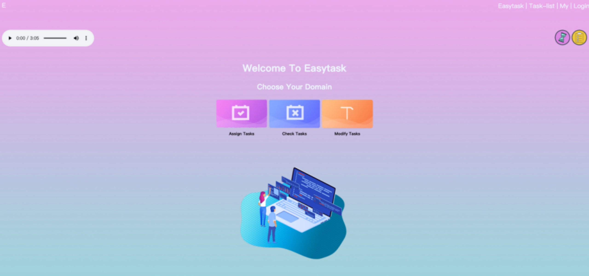

However, through testing and feedback, some functions need to be improved. For the task list, when users add and fill in content information, the system cannot give quick feedback. Therefore, users will be confused. They need to switch to the list page to see the tasks they have added.

As for the time management function, the color of the interface does not match the background and needs to be further beautified. And it lacks the function of pomodoro timer.

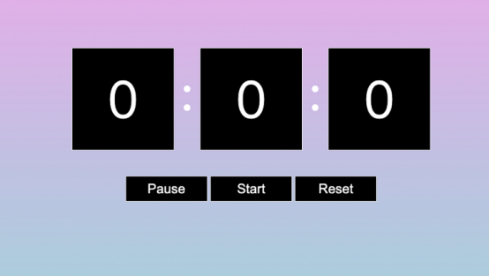

The function of the dictionary is not strong, and users feel inconvenient and useful when using it. So, after thinking and adjusting, I decided to replace acronym maker with dictionary lookup. And separate the design page from the task list to avoid clutter

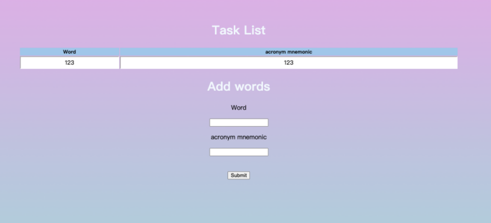

About the registration interface, the overall design aesthetic feeling is not good enough

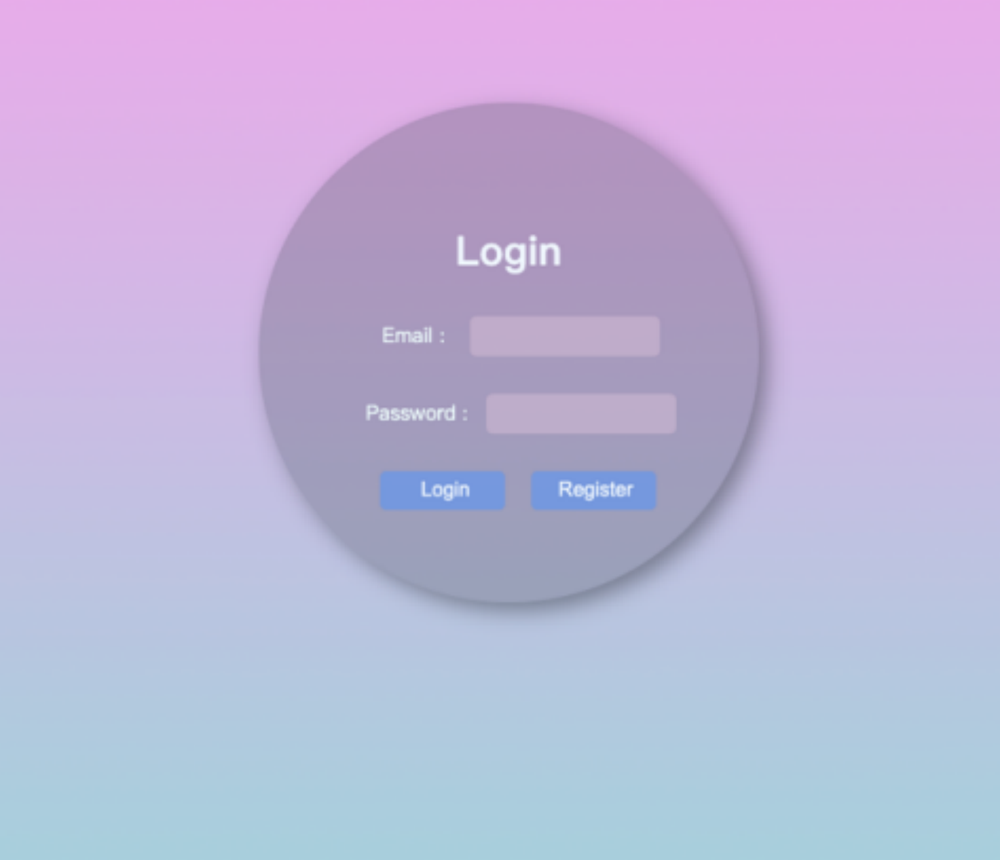

In order to further change the overall functionality and aesthetics, I have made a better design for the overall website. I changed the layout to make the functions look more compact and attract users' attention. I changed the interface of the music player to make it more convenient and concise.

The task management interface has been changed synchronously. However, I found that today's separate pages are not smooth for users to use, so I planned to merge them

The function of the dictionary is perfectly realized. However, when using it, I found that the historical records could not be overwritten, and the overall interface was too unclear, so the user could not immediately understand the use method

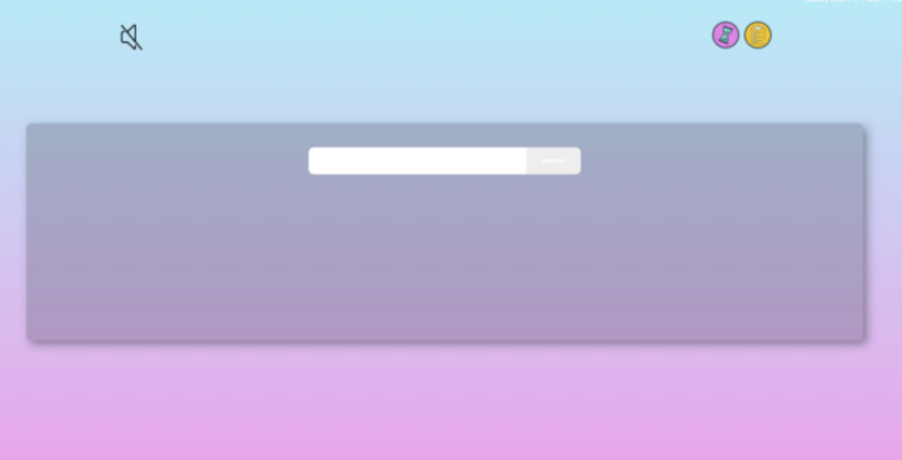

Since the function implementation of the modify tasks is very low, and after feedback, I found that the user does not think this function has enough availability, so I consider changing and replacing this function

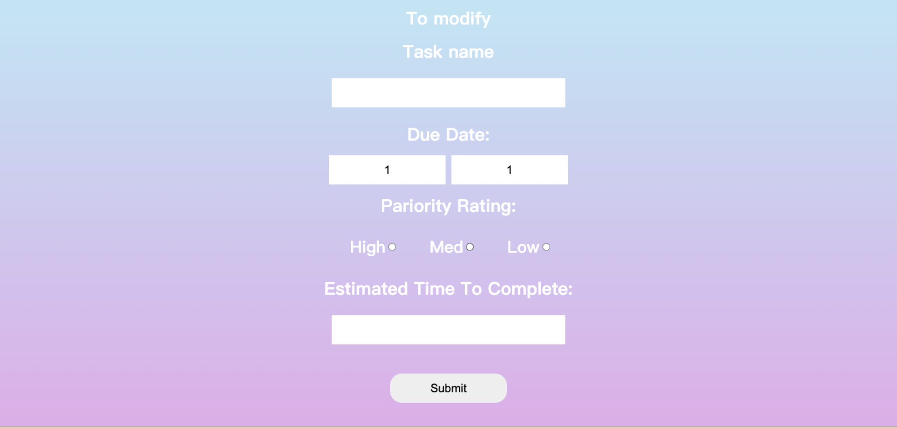

The design of the time manager has been changed, but it seems that pomodoro timer cannot be taken into account in this plug-in page, so I consider creating a new interface

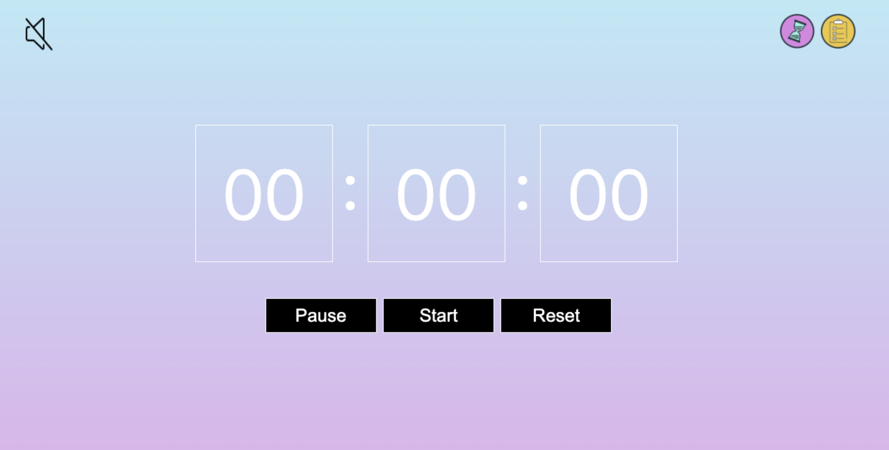

The design of the registration interface is changed synchronously. I found that the functions of my interface and login interface are repeated, and users may have unreasonable logic in the use process. So I'm thinking about making it two in one and simplifying the changes

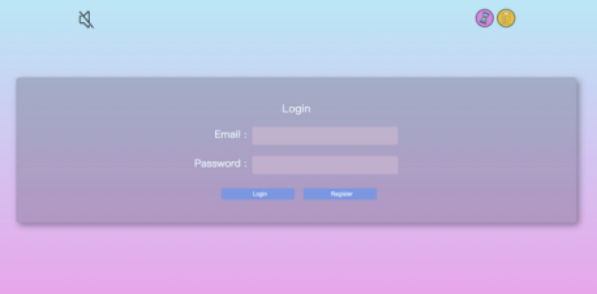

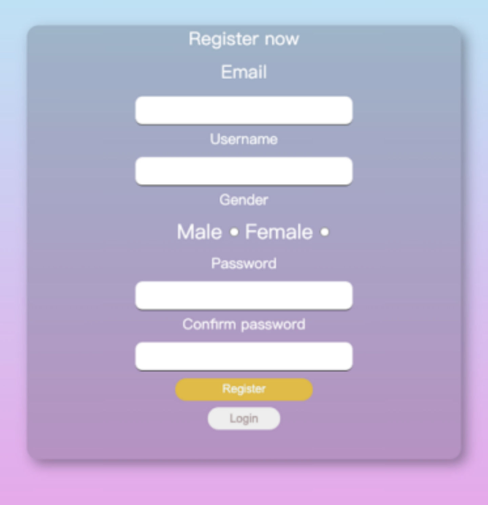

Then, the three main functions of the home page were determined, namely Covey quadrants, pomodoro timer and auxiliary suggestions. After testing and feedback, I think what users need most is to know the importance of each task when managing their own schedule, so as to make plans for themselves faster. They need to focus on completing the project, so a pomodoro pact to productivity is effective.

In the list, the user can directly click to add task at the bottom. After testing and modification, the task added by the user will immediately appear in the list. In addition, completion status and deletion functions have been added. For convenience, I designed the completion status can be changed by double-click, so that users can modify it at any time. In addition, users can delete tasks if they are added incorrectly or unneeded. In addition, I changed the colors of the three priorities to make the project look more intuitive

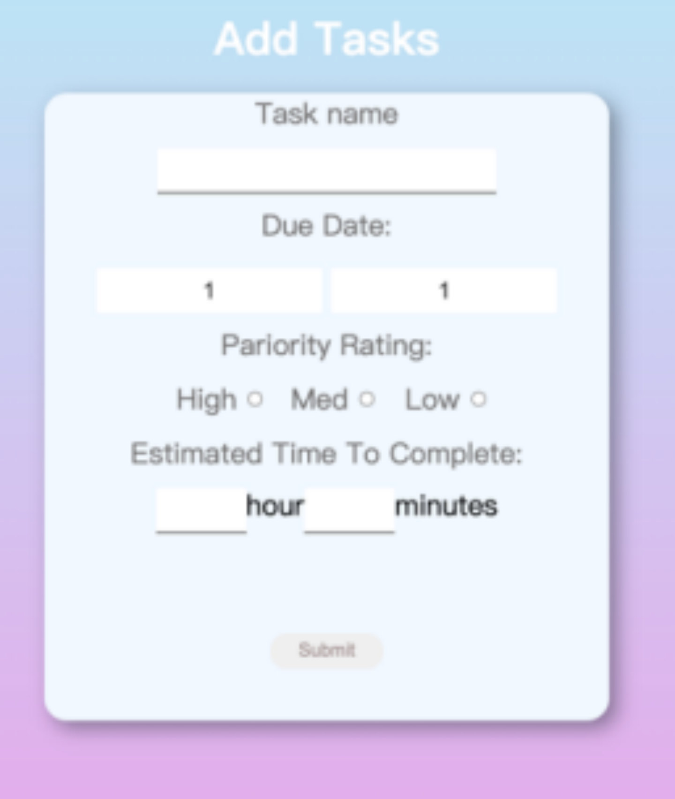

As for the Pomodoro Timer, users can customize their desired working time or rest time. If no changes are made, then the default times = 25 mins on, 5 mins off (x4) then 30 mins break

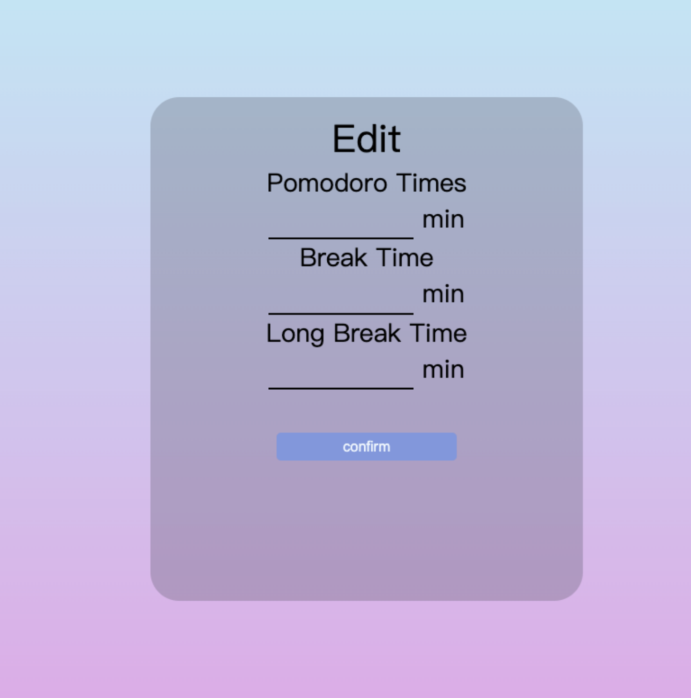

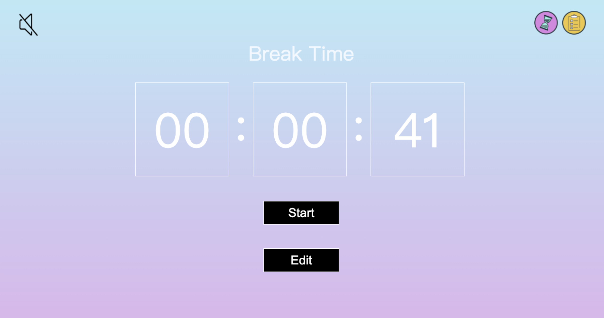

The dictionary function has been added with a title to make it more intuitive. At the same time, the previous queried word is automatically cleared by default

For the personal account， I deleted MY page and merged it with the account interface. Users can register by email, and they need to fill in passwords containing upper and lower case English characters and numbers to improve security. After logging in to the account, users can see their own account information on the login page. If they want to switch or log out of their accounts, they can sign out directly below

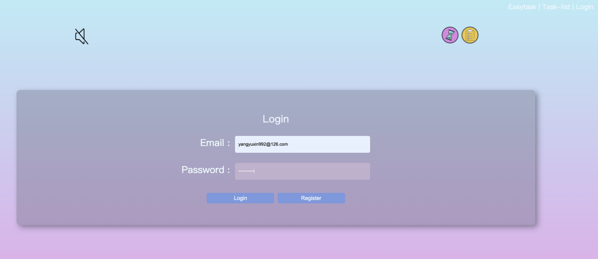

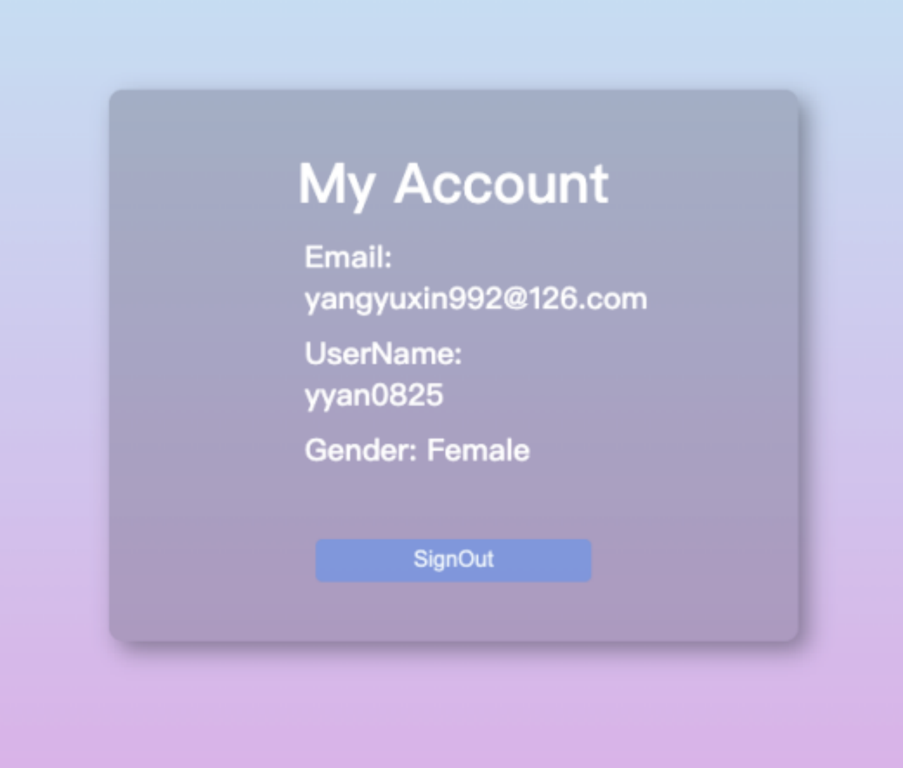

The main function of the auxiliary suggestions interface is that users can input their own age and learning needs. The system will automatically provide reference websites for suggestions according to the options, to improve the efficiency of users in completing the course to a certain extent.

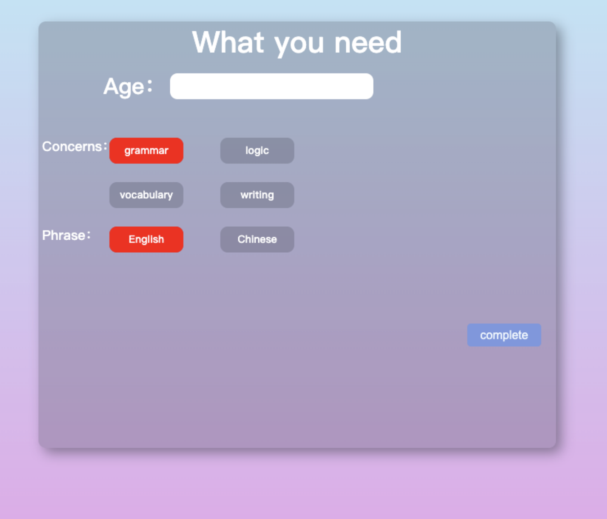

Finally, through a series of modifications and design iterations, the error of details is improved and more click responses are added. Finally, an effective, usable and convenient learning website application was completed. At the same time, it is also adapted to the mobile terminal, so that users can use it anytime, anywhere

iconfont-音量. (n.d.). Iconfont.
https://www.iconfont.cn/search/index?searchType=icon&q=%E9%9F%B3%E9%87%8F&page=1

Flaticon. (2022, May 31). Dictionary Icon. 

https://www.flaticon.com/free-icon/dictionary_3256142

Roach, N. (n.d.). Time timer icon - Circle Icons. Icons For Free. https://icons-for-free.com/time+timer+icon-1320087275815015291/

Faith and Fellowship Greetings — Capital Community Media — Salem, Oregon. (2022). Capital Community Media. 

https://www.capitalcommunitymedia.org/faithandfellowship

A.(2021, September 6). Hire-ml-engineers -. Admin.

 https://persystentsoft.com/hire-ml-engineers/

The Sound Of Silence ( Original Version From 1964). (2022). Internet Archive. https://archive.org/details/TheSoundOfSilenceOriginalVersionFrom1964_201706

Moon, L. (2021, March 18). How To Use The Pomodoro Method For A Permanently Productive Life. Trello.

 https://blog.trello.com/how-to-pomodoro-your-way-to-productivity

public-apis. (n.d.). GitHub - public-apis/public-apis: A collective list of free APIs. GitHub. https://github.com/public-apis/public-apis#dictionaries

Time Management For Students Matrix. (2022). Mytimemanagement.Com. http://www.mytimemanagement.com/time-management-for-students.html
